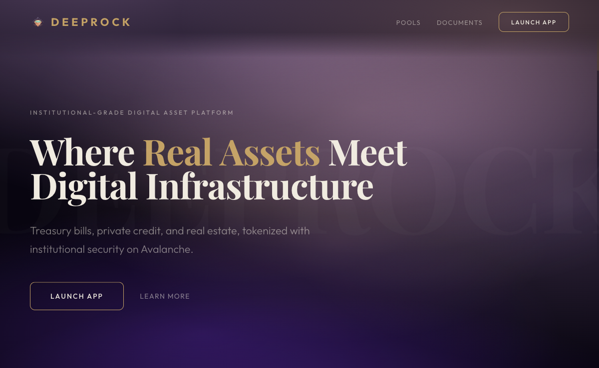

# DeepRock — Institutional RWA Platform on Avalanche

> Tokenized real-world assets — treasury bills, private credit, and real estate — accessible on-chain.

[](https://www.typescriptlang.org/)
[](https://www.avax.network/)
[](https://soliditylang.org/)
[](LICENSE)



## Live Demo

**[→ deeprock-app.vercel.app](https://deeprock-app.vercel.app)**

---

## What Is DeepRock?

DeepRock bridges institutional-grade investments and DeFi. Investors deposit USDC into on-chain pools backed by tokenized real-world assets — treasury bills, private credit facilities, and real estate — with NAV-based pricing, biometric authentication, and gasless transactions via ERC-4337 account abstraction.

---

## Features

- **RWA Investment Pools** — USDC-denominated pools with daily NAV updates reflecting real yield
- **Biometric Auth** — Passkey (WebAuthn/P256) wallet creation — no seed phrases
- **Gasless Transactions** — ERC-4337 Paymaster covers gas; investors only need USDC
- **Portfolio Dashboard** — Track positions, yields, and transaction history
- **Document Vault** — On-chain document registry for compliance materials
- **Smart Account Wallets** — P256 smart wallets with biometric signing

---

## Tech Stack

| Layer | Technology |
|-------|-----------|
| Frontend | Next.js 14, TypeScript, Tailwind CSS, shadcn/ui |
| Blockchain | Avalanche (Fuji Testnet), Hardhat, Solidity 0.8.24 |
| Account Abstraction | ERC-4337, P256SmartWallet, RWAPaymaster |
| Auth | WebAuthn / Passkeys (SimpleWebAuthn) |
| Backend | Node.js, TypeScript, Relayer, Indexer |
| State | Zustand, viem |

---

## Smart Contracts

| Contract | Description |
|----------|-------------|
| `RWAPool` | Investment pool with USDC deposits, NAV-based pricing, fee logic |
| `P256SmartWallet` | ERC-4337 smart wallet with biometric P256 signature verification |
| `BiometricRegistry` | On-chain registry mapping passkeys to wallet addresses |
| `RWAPaymaster` | Sponsors gas for verified smart wallet users |
| `P256WalletFactory` | Factory for deterministic smart wallet deployment |

---

## Architecture

```
Investor
    │
    ▼
Passkey Authentication (WebAuthn)
    │
    ▼
P256 Smart Wallet (ERC-4337)
    │
    ├── Deposit USDC → RWAPool
    │       │
    │       ▼
    │   NAV-priced pool shares issued
    │   (backed by treasury bills / private credit / real estate)
    │
    └── Withdraw → USDC returned at current NAV

RWAPaymaster covers all gas costs
```

---

## Running Locally

```bash
git clone https://github.com/dmz4pf/deeprock.git
cd deeprock
npm install

# Start frontend
npm run frontend:dev

# Start backend
npm run backend:dev

# Compile contracts
npm run contracts:compile
```

---

## Project Structure

```
deeprock/
├── frontend/          # Next.js app
│   ├── src/app/
│   │   ├── (app)/     # Authenticated routes
│   │   │   ├── pools/       # Browse & invest in RWA pools
│   │   │   ├── portfolio/   # Track your positions
│   │   │   └── documents/   # Compliance documents
│   │   └── (auth)/    # Passkey login / registration
├── backend/           # Node.js relayer + indexer
│   └── src/
│       ├── routes/    # REST API (pools, portfolio, auth, relayer)
│       └── services/  # Indexer, UserOp relayer, NAV updater
└── contracts/         # Solidity smart contracts
    └── src/
        ├── RWAPool.sol
        ├── P256SmartWallet.sol
        ├── BiometricRegistry.sol
        └── RWAPaymaster.sol
```

---

## License

MIT
