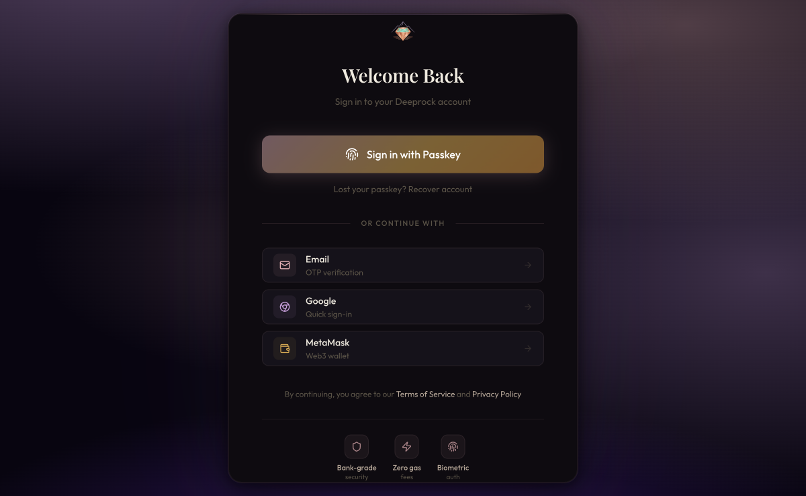
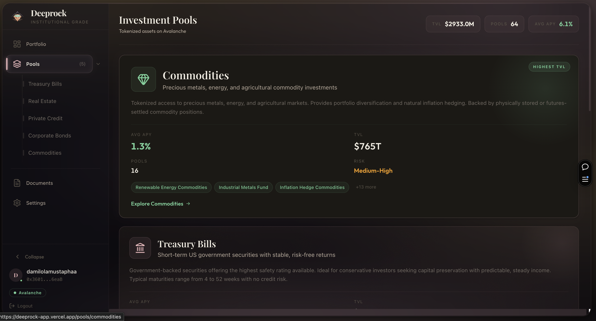
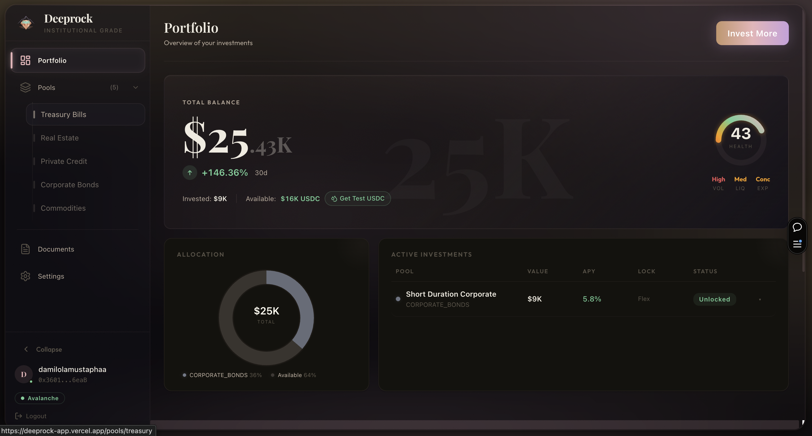
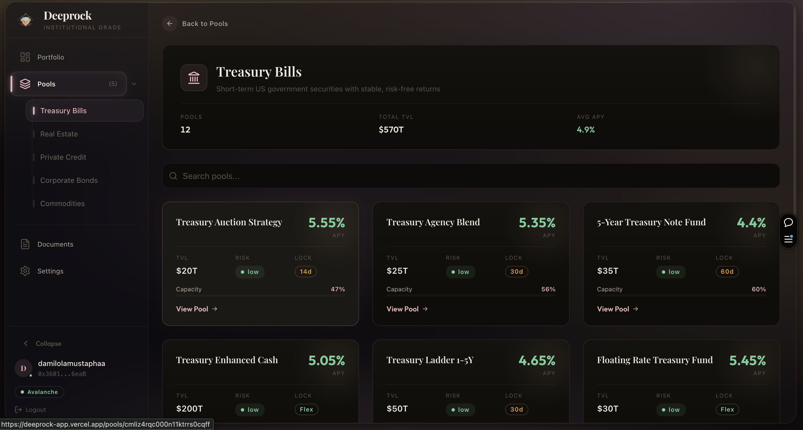

# DeepRock: RWA Investment Platform on Avalanche

Tokenized real-world assets on-chain: treasury bills, private credit, real estate, corporate bonds, and commodities.

[](https://www.typescriptlang.org/)
[](https://www.avax.network/)
[](https://soliditylang.org/)
[](LICENSE)


## Live Demo

**[deeprock-app.vercel.app](https://deeprock-app.vercel.app)**

Create an account with a passkey (biometric) to explore the full platform. No wallet or seed phrase needed.

## Demo Video

https://youtu.be/YeziPNxaUwE

---

## Features

- **Biometric wallets**: ERC-4337 smart wallets with WebAuthn passkeys. Face ID or fingerprint, no seed phrases
- **Gasless transactions**: Paymaster covers all gas. Users only ever touch USDC
- **NAV-priced pools**: Five asset categories with daily net asset value updates reflecting actual yield
- **Account abstraction**: P256 smart wallet deployed per user, deterministic address tied to passkey
- **Multi-auth**: Passkey, Google OAuth, or MetaMask sign-in
- **Portfolio tracking**: Real-time positions, 30-day performance, allocation breakdown, health score
- **On-chain contracts**: Five Solidity contracts handling pools, wallets, biometric registry, gas sponsorship, and factory deployment

---

## Screenshots

| Login | Investment Pools |
|-------|-----------------|
|  |  |

| Portfolio | Pool Detail |
|-----------|------------|
|  |  |

---

## How It Works

**Account abstraction (ERC-4337):** Each user gets a P256 smart wallet deployed on-chain. The wallet is controlled by a biometric passkey credential stored on the user's device, not a seed phrase. The wallet address is deterministic and tied to the passkey's public key.

**Gasless transactions:** A Paymaster contract sponsors all gas fees. Users never hold AVAX. They deposit USDC, the Paymaster pays for everything, and the transaction goes through via the ERC-4337 UserOperation flow.

**NAV pricing:** Each pool has a net asset value updated daily. When you deposit, you receive pool shares priced at the current NAV. When you withdraw, shares are redeemed at the current NAV, which has increased based on yield accrued since your deposit.

---

## Tech Stack

| Layer | Technology |
|-------|-----------|
| Frontend | Next.js 14, TypeScript, Tailwind CSS, shadcn/ui |
| Blockchain | Avalanche Fuji Testnet, Hardhat, Solidity 0.8.24 |
| Account Abstraction | ERC-4337, P256SmartWallet, RWAPaymaster |
| Auth | WebAuthn / Passkeys (SimpleWebAuthn), Google OAuth |
| Backend | Node.js, TypeScript, Express |
| State | Zustand, viem |

---

## Testing the App

The app runs on Avalanche Fuji testnet. No real funds, no wallet setup, no extensions needed.

---

### Part 1: Create an account

Go to [deeprock-app.vercel.app](https://deeprock-app.vercel.app) and click **Launch App**.

Three sign-in options:

**Passkey (recommended)**

Click "Sign in with Passkey". Your device prompts you to save a biometric credential using Face ID, fingerprint, or PIN. No password. No seed phrase.

A P256 smart wallet is deployed on Avalanche Fuji and linked to your passkey in the background. You land on the dashboard with a wallet address already assigned.

Passkey support by device:
- iPhone / iPad: Face ID or Touch ID
- Android: fingerprint or screen lock
- Mac (Chrome / Safari): Touch ID
- Windows (Chrome / Edge): Windows Hello
- No biometrics: falls back to PIN

**Google**

Click "Google" and complete OAuth. A smart wallet is created and linked to your Google account.

**MetaMask**

Click "MetaMask" and approve the connection. This links your existing EOA wallet rather than creating a new smart wallet.

---

### Part 2: Get test USDC and invest

**1. Get test USDC**

Go to **Portfolio** in the left sidebar. Click the **"Get Test USDC"** button at the top. Test USDC is minted directly to your smart wallet. Balance updates within seconds. No external faucet needed.

**2. Browse pools**

Click **Pools** in the sidebar. Five asset categories:

| Category | Risk | Typical APY | Lock Period |
|----------|------|-------------|-------------|
| Treasury Bills | Low | 4-6% | None (flexible) |
| Real Estate | Medium | 8-12% | 90 days |
| Private Credit | High | 14-18% | 180 days |
| Corporate Bonds | Medium | 6-9% | 30 days |
| Commodities | Medium | 7-10% | 60 days |

Click any pool to see current APY, TVL, minimum deposit, lock period, and NAV chart.

**3. Make an investment**

1. On a pool detail page, click **Invest**
2. Enter a USDC amount (must meet the pool minimum)
3. Confirmation modal shows: amount, pool shares at current NAV, lock period
4. Confirm with your passkey (biometric prompt) or wallet signature
5. Transaction is bundled as a UserOperation. Paymaster covers gas. You only spend USDC.
6. Position appears in Portfolio

Flexible pools (Treasury Bills) allow invest and withdraw in the same session for a full round-trip test.

**4. Track and withdraw**

**Portfolio** shows: total balance, 30-day performance, each active position with value/APY/unlock timer, allocation pie chart, and health score.

To withdraw: open any position and click **Withdraw**. Flexible pools withdraw instantly at current NAV. Locked pools unlock when the period expires.

---

### Part 3: Run tests locally

**Smart contract tests (Hardhat)**

```bash
cd contracts
npm install
npx hardhat test
```

Tests cover P256 signature verification and the BiometricRegistry contract.

**Frontend**

```bash
cd frontend
npm install
npm run dev
```

Opens at `http://localhost:3000`

**Backend**

```bash
cd backend
npm install
npm run dev
```

API server starts on the configured port.

**Full project from root:**

```bash
git clone https://github.com/dmustapha/deeprock.git
cd deeprock
npm install

# Start frontend
npm run frontend:dev

# Start backend (separate terminal)
npm run backend:dev

# Compile contracts
npm run contracts:compile
```

---

## Smart Contracts

| Contract | Description |
|----------|-------------|
| `RWAPool` | Investment pool with USDC deposits, NAV-based share pricing, and fee logic |
| `P256SmartWallet` | ERC-4337 smart wallet with biometric P256 signature verification |
| `BiometricRegistry` | On-chain registry mapping passkey public keys to wallet addresses |
| `RWAPaymaster` | Sponsors gas for verified smart wallet UserOperations |
| `P256WalletFactory` | Factory for deterministic smart wallet deployment via CREATE2 |

All contracts deployed on Avalanche Fuji. Source in `contracts/src/`.

---

## API Reference

Backend REST API. All `/api/pools` endpoints are public. All others require authentication.

### Pools

| Method | Endpoint | Description |
|--------|----------|-------------|
| `GET` | `/api/pools` | List all investment pools |
| `GET` | `/api/pools/summary` | Platform-wide pool statistics |
| `GET` | `/api/pools/:id` | Get pool detail (APY, TVL, NAV history) |
| `POST` | `/api/pools/:id/invest` | Deposit USDC into a pool |

### Portfolio (auth required)

| Method | Endpoint | Description |
|--------|----------|-------------|
| `GET` | `/api/portfolio` | Get user positions, balances, health score |
| `GET` | `/api/portfolio/yield` | Yield accrued across all positions |
| `GET` | `/api/portfolio/transactions` | Transaction history |
| `GET` | `/api/portfolio/credentials` | Passkey credentials linked to account |
| `GET` | `/api/portfolio/documents` | Compliance documents |
| `GET` | `/api/portfolio/history` | Historical portfolio snapshots |

### Auth

| Method | Endpoint | Description |
|--------|----------|-------------|
| `POST` | `/api/auth/register-options` | Get WebAuthn registration challenge |
| `POST` | `/api/auth/register-verify` | Verify passkey registration |
| `POST` | `/api/auth/login-options` | Get WebAuthn login challenge |
| `POST` | `/api/auth/login-verify` | Verify passkey login |
| `GET` | `/api/auth/session` | Get current session |
| `POST` | `/api/auth/logout` | End session |
| `GET` | `/api/auth/google` | Start Google OAuth flow |
| `GET` | `/api/auth/google/callback` | Google OAuth callback |
| `GET` | `/api/auth/passkeys` | List user passkeys |
| `DELETE` | `/api/auth/passkeys/:id` | Remove a passkey |

### Relayer

| Method | Endpoint | Description |
|--------|----------|-------------|
| `GET` | `/api/relayer/status` | Relayer health and balance |
| `POST` | `/api/relayer/estimate-gas` | Estimate gas for a UserOperation |
| `POST` | `/api/relayer/faucet` | Mint test USDC to a wallet |
| `GET` | `/api/relayer/usdc-balance/:address` | Check USDC balance for any address |

### UserOperations (ERC-4337)

| Method | Endpoint | Description |
|--------|----------|-------------|
| `POST` | `/api/userop/submit` | Submit a signed UserOperation |
| `POST` | `/api/userop/build` | Build an unsigned UserOperation |
| `GET` | `/api/userop/:id` | Get UserOperation status |

### Swap

| Method | Endpoint | Description |
|--------|----------|-------------|
| `GET` | `/api/swap/quote` | Get swap quote |
| `POST` | `/api/swap/build` | Build swap transaction |
| `POST` | `/api/swap/submit` | Submit swap |
| `GET` | `/api/swap/:id` | Get swap status |
| `GET` | `/api/swap` | List user swaps |

### Monitoring

| Method | Endpoint | Description |
|--------|----------|-------------|
| `GET` | `/api/monitoring/health` | Overall system health |
| `GET` | `/api/monitoring/health/relayer` | Relayer status |
| `GET` | `/api/monitoring/health/paymaster` | Paymaster balance and status |
| `GET` | `/api/monitoring/health/rpc` | RPC connection status |
| `GET` | `/api/monitoring/metrics` | System metrics |

---

## Architecture

```
User
    |
    v
Passkey (WebAuthn / P256 credential on device)
    |
    v
P256SmartWallet (ERC-4337 smart account on Fuji)
    |
    +-- Deposit USDC
    |       |
    |       v
    |   RWAPool
    |       |
    |       v
    |   NAV-priced shares issued
    |   (backed by treasury bills / private credit / real estate)
    |
    +-- Withdraw
            |
            v
        USDC returned at current NAV

RWAPaymaster covers all gas for every transaction
```

---

## Project Structure

```
deeprock/
├── frontend/          # Next.js app
│   ├── src/app/
│   │   ├── (app)/
│   │   │   ├── pools/       # Browse and invest in RWA pools
│   │   │   ├── portfolio/   # Track your positions
│   │   │   └── documents/   # Compliance documents
│   │   └── (auth)/          # Passkey login / registration
├── backend/           # Node.js relayer + indexer
│   └── src/
│       ├── routes/    # REST API (pools, portfolio, auth, relayer, userop, swap)
│       └── services/  # Indexer, UserOp relayer, NAV updater
└── contracts/         # Solidity smart contracts
    ├── src/
    │   ├── RWAPool.sol
    │   ├── P256SmartWallet.sol
    │   ├── BiometricRegistry.sol
    │   └── RWAPaymaster.sol
    └── test/
        ├── P256Verifier.test.ts
        └── BiometricRegistry.test.ts
```

---

## License

MIT
