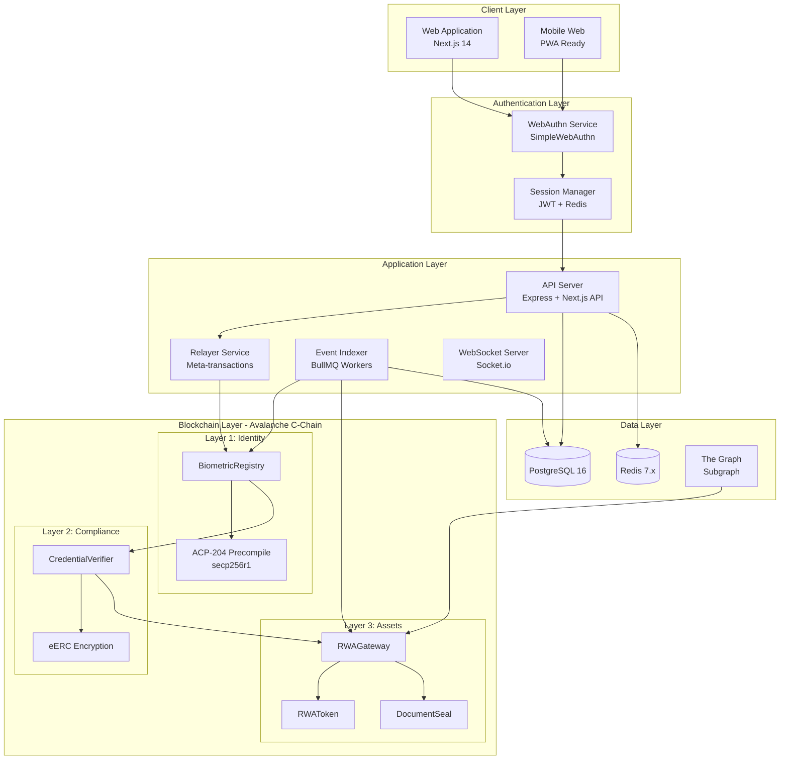
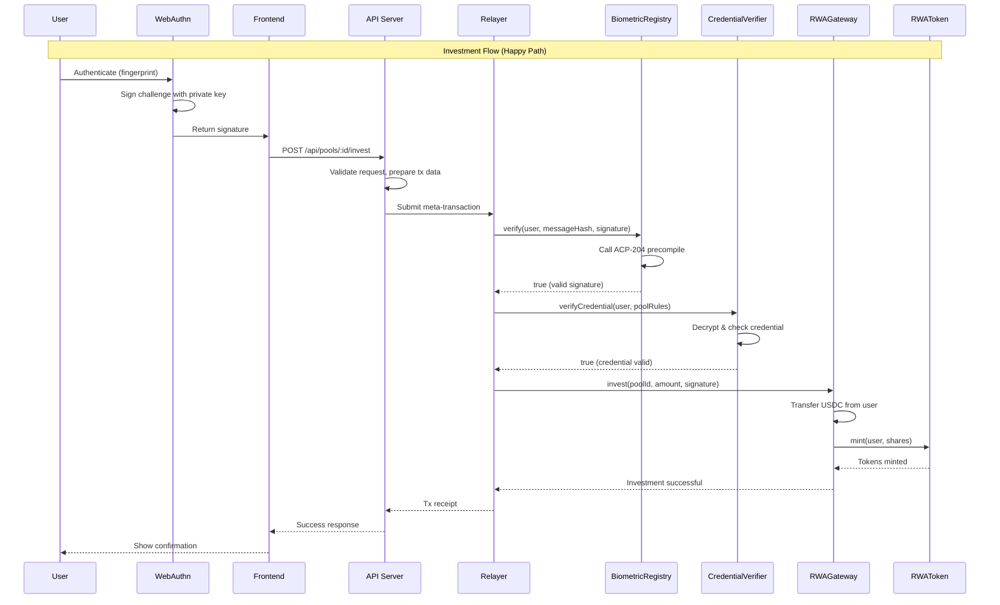

# RWA Gateway Architecture Document
## Phase 1: Executive Overview & System Architecture

**Version:** 1.0
**Date:** February 4, 2026
**Status:** DRAFT
**Project:** RWA Gateway - Biometric Real-World Asset Tokenization on Avalanche

---

## Table of Contents

1. [Executive Summary](#1-executive-summary)
2. [System Architecture Overview](#2-system-architecture-overview)
3. [Architecture Principles](#3-architecture-principles)
4. [Technology Landscape](#4-technology-landscape)
5. [System Boundaries & Interfaces](#5-system-boundaries--interfaces)
6. [Architecture Decision Records](#6-architecture-decision-records-adrs)

---

## 1. Executive Summary

### 1.1 Vision & Mission Statement

**Vision:** To become the definitive gateway between traditional real-world assets and decentralized finance, enabling seamless, private, and compliant investment through biometric authentication.

**Mission:** Build the first biometric-authenticated, privacy-preserving platform for tokenizing, accessing, and trading real-world assets (RWAs) on Avalanche, leveraging native cryptographic primitives that are impossible to replicate on any other EVM chain.

**Tagline:** "Touch to Invest. Prove Without Exposing. Own the Real World."

### 1.2 Problem Statement

The tokenized RWA market represents a $33B+ opportunity growing to $500B-3T by 2030, yet three critical barriers prevent mass adoption:

| Barrier | Current State | Impact |
|---------|---------------|--------|
| **Identity Exposure** | Full KYC with centralized platforms storing government IDs, proof of income, accreditation documents in honeypot databases | Privacy-conscious investors and institutions refuse participation |
| **On-Chain Transparency** | Transaction amounts visible to entire world, portfolio sizes traceable to wallets | Institutional investors won't operate in this environment |
| **Wallet Complexity** | Seed phrases, browser extensions, gas management required | 95% of addressable market (wealth managers, accredited investors) eliminated by friction |

### 1.3 Solution Overview

RWA Gateway is a three-layer protocol stack built entirely on Avalanche C-Chain:

```
┌─────────────────────────────────────────────────────────────────────────────┐
│                           USER INTERACTION LAYER                             │
│  ┌─────────────┐  ┌─────────────┐  ┌─────────────┐  ┌─────────────────────┐ │
│  │  WebAuthn   │  │   Next.js   │  │  Dashboard  │  │  Investment Portal  │ │
│  │  Biometric  │  │   Frontend  │  │   & Charts  │  │  & Redemption       │ │
│  └──────┬──────┘  └──────┬──────┘  └──────┬──────┘  └──────────┬──────────┘ │
└─────────┼────────────────┼────────────────┼─────────────────────┼───────────┘
          │                │                │                     │
          ▼                ▼                ▼                     ▼
┌─────────────────────────────────────────────────────────────────────────────┐
│                           APPLICATION LAYER                                  │
│  ┌─────────────┐  ┌─────────────┐  ┌─────────────┐  ┌─────────────────────┐ │
│  │  API Server │  │  Relayer    │  │   Event     │  │  Background Jobs    │ │
│  │  (Express)  │  │  Service    │  │   Indexer   │  │  (BullMQ)           │ │
│  └──────┬──────┘  └──────┬──────┘  └──────┬──────┘  └──────────┬──────────┘ │
└─────────┼────────────────┼────────────────┼─────────────────────┼───────────┘
          │                │                │                     │
          ▼                ▼                ▼                     ▼
┌─────────────────────────────────────────────────────────────────────────────┐
│                         BLOCKCHAIN LAYER (Avalanche C-Chain)                 │
│                                                                              │
│   ┌──────────────────┐    ┌──────────────────┐    ┌──────────────────┐      │
│   │  LAYER 1:        │    │  LAYER 2:        │    │  LAYER 3:        │      │
│   │  BiometricAuth   │───▶│  CredentialVault │───▶│  RWAGateway      │      │
│   │                  │    │                  │    │                  │      │
│   │  ┌────────────┐  │    │  ┌────────────┐  │    │  ┌────────────┐  │      │
│   │  │ Biometric  │  │    │  │ Credential │  │    │  │ RWAGateway │  │      │
│   │  │ Registry   │  │    │  │ Verifier   │  │    │  │ Contract   │  │      │
│   │  └────────────┘  │    │  └────────────┘  │    │  └────────────┘  │      │
│   │                  │    │                  │    │  ┌────────────┐  │      │
│   │  ┌────────────┐  │    │  ┌────────────┐  │    │  │ RWAToken   │  │      │
│   │  │ ACP-204    │  │    │  │ eERC       │  │    │  │ (per pool) │  │      │
│   │  │ Precompile │  │    │  │ Encryption │  │    │  └────────────┘  │      │
│   │  └────────────┘  │    │  └────────────┘  │    │  ┌────────────┐  │      │
│   │                  │    │                  │    │  │ Document   │  │      │
│   │                  │    │                  │    │  │ Seal       │  │      │
│   └──────────────────┘    └──────────────────┘    │  └────────────┘  │      │
│                                                   └──────────────────┘      │
└─────────────────────────────────────────────────────────────────────────────┘
          │                │                │                     │
          ▼                ▼                ▼                     ▼
┌─────────────────────────────────────────────────────────────────────────────┐
│                           DATA LAYER                                         │
│  ┌─────────────┐  ┌─────────────┐  ┌─────────────┐  ┌─────────────────────┐ │
│  │ PostgreSQL  │  │   Redis     │  │  The Graph  │  │  IPFS (future)      │ │
│  │ (Primary)   │  │   (Cache)   │  │  (Indexer)  │  │  (Document storage) │ │
│  └─────────────┘  └─────────────┘  └─────────────┘  └─────────────────────┘ │
└─────────────────────────────────────────────────────────────────────────────┘
```

### 1.4 Key Differentiators

| Differentiator | RWA Gateway | Competitors (Securitize, Ondo, Centrifuge) |
|----------------|-------------|-------------------------------------------|
| **Authentication** | Biometric (fingerprint/Face ID) verified on-chain | Email/password or wallet-only |
| **Privacy** | eERC encrypted credentials & balances | None (public chain transparency) |
| **KYC Model** | Decentralized (on-chain verification) | Centralized (data silos) |
| **Chain** | Avalanche-exclusive (ACP-204 + eERC) | Multi-chain or Ethereum |
| **Gas UX** | Gasless via relayer | User pays gas |
| **Onboarding** | 2 minutes, no seed phrase | Complex wallet setup |
| **DeFi Composability** | Native (RWA tokens are ERC-20) | Walled garden |

### 1.5 Market Opportunity

```
                    RWA Market Growth Trajectory

    $3T ─┤                                              ╭────
        │                                          ╭───╯
        │                                      ╭──╯
    $2T ─┤                                  ╭─╯
        │                              ╭───╯
        │                          ╭──╯
    $1T ─┤                      ╭─╯
        │                  ╭───╯
        │              ╭──╯
  $500B ─┤          ╭─╯
        │      ╭───╯
        │  ╭──╯
   $33B ─┼─╯
        │
        └─────┬─────┬─────┬─────┬─────┬─────┬─────┬─────┬
            2025  2026  2027  2028  2029  2030  2031  2032
```

**Key Market Data:**
- Current RWA Market Size: $33B+ on-chain
- Projected 2030: $500B - $3T
- Avalanche RWA TVL: $1.3B+
- BlackRock BUIDL Fund: $2.8B AUM (single largest tokenized fund)
- Community Builder Activity: 2/2,861 mentions of RWA (99.93% ignoring fastest-growing sector)

---

## 2. System Architecture Overview

### 2.1 High-Level Architecture Diagram



### 2.2 Three-Layer Protocol Stack - Detailed Explanation

#### 2.2.1 Layer 1: BiometricAuth (Identity Layer)

**Purpose:** Provide passwordless, on-chain verifiable identity through biometric authentication.

**How It Works:**
1. User initiates registration via browser WebAuthn API
2. Device Secure Enclave/TPM generates secp256r1 key pair
3. Public key (x, y coordinates) extracted from attestation
4. Public key registered on-chain in BiometricRegistry contract
5. Every subsequent action authenticated by:
   - Client requesting biometric verification
   - Device signing challenge with private key
   - Signature verified on-chain via ACP-204 precompile

**Key Components:**

| Component | Technology | Function |
|-----------|------------|----------|
| BiometricRegistry Contract | Solidity 0.8.24 | Stores secp256r1 public keys, manages identity lifecycle |
| ACP-204 Precompile | Avalanche Native | Verifies secp256r1 signatures at ~3,450 gas (vs 250,000+ in Solidity) |
| WebAuthn Client | SimpleWebAuthn 10.x | Browser-side credential management |
| Authentication Counter | On-chain uint256 | Replay attack protection |

**Data Flow:**

```
┌──────────┐     ┌──────────┐     ┌──────────┐     ┌──────────┐
│  Browser │     │  Secure  │     │  Backend │     │ Avalanche│
│          │     │  Enclave │     │  Server  │     │  C-Chain │
└────┬─────┘     └────┬─────┘     └────┬─────┘     └────┬─────┘
     │                │                │                │
     │ 1. Register    │                │                │
     ├───────────────▶│                │                │
     │                │ 2. Generate    │                │
     │                │    Key Pair    │                │
     │                │    (secp256r1) │                │
     │ 3. Attestation │                │                │
     │◀───────────────┤                │                │
     │                │                │                │
     │ 4. Send Attestation             │                │
     ├────────────────────────────────▶│                │
     │                │                │                │
     │                │                │ 5. Extract     │
     │                │                │    Public Key  │
     │                │                │                │
     │                │                │ 6. Register    │
     │                │                │    On-Chain    │
     │                │                ├───────────────▶│
     │                │                │                │
     │                │                │ 7. Tx Receipt  │
     │                │                │◀───────────────┤
     │                │                │                │
     │ 8. Success     │                │                │
     │◀────────────────────────────────┤                │
     │                │                │                │
```

#### 2.2.2 Layer 2: CredentialVault (Compliance Layer)

**Purpose:** Enable privacy-preserving compliance verification without exposing sensitive user data on-chain.

**How It Works:**
1. User submits KYC documents to trusted off-chain verifier
2. Verifier validates documents (accreditation, jurisdiction, investor tier)
3. Verifier issues on-chain credential via CredentialVerifier contract
4. Credential data encrypted using eERC (if available) or access-controlled
5. Smart contracts can verify credentials without revealing underlying data

**Credential Types:**

| Type ID | Name | Description | Investment Limits |
|---------|------|-------------|-------------------|
| 1 | Accredited | SEC accredited investor | Up to $500K |
| 2 | Qualified | Qualified purchaser | Up to $5M |
| 3 | Institutional | Institutional investor | Unlimited |
| 4 | Retail-Restricted | Non-accredited, limited access | Up to $10K |

**Jurisdiction Support:**
- ISO 3166-1 alpha-2 codes (US, GB, SG, EU, etc.)
- Per-pool jurisdiction whitelisting
- Automatic OFAC/sanctions screening integration point

**eERC Encryption Model:**

```
┌─────────────────────────────────────────────────────────────────┐
│                    Credential Data Structure                     │
├─────────────────────────────────────────────────────────────────┤
│  ┌──────────────┐  ┌──────────────┐  ┌──────────────┐          │
│  │ credType: 1  │  │ jurisdiction │  │   tier: 2    │          │
│  │ (Accredited) │  │    : "US"    │  │ ($50K-$500K) │          │
│  └──────┬───────┘  └──────┬───────┘  └──────┬───────┘          │
│         │                 │                 │                   │
│         ▼                 ▼                 ▼                   │
│  ┌─────────────────────────────────────────────────────────┐   │
│  │                    eERC Encryption                       │   │
│  │  ┌─────────────────────────────────────────────────┐    │   │
│  │  │  encryptedData = Encrypt(                       │    │   │
│  │  │    plaintext: {credType, jurisdiction, tier},   │    │   │
│  │  │    key: userPublicKey + contractKey             │    │   │
│  │  │  )                                              │    │   │
│  │  └─────────────────────────────────────────────────┘    │   │
│  └─────────────────────────────────────────────────────────┘   │
│         │                                                       │
│         ▼                                                       │
│  ┌─────────────────────────────────────────────────────────┐   │
│  │  On-Chain Storage (visible to observers):                │   │
│  │  0x8a7f2c...9e3b (encrypted blob - unreadable)          │   │
│  └─────────────────────────────────────────────────────────┘   │
│         │                                                       │
│         ▼                                                       │
│  ┌─────────────────────────────────────────────────────────┐   │
│  │  Authorized Contract Verification:                       │   │
│  │  RWAGateway.verifyCredential(user) → true/false         │   │
│  │  (Decrypts internally, returns boolean only)            │   │
│  └─────────────────────────────────────────────────────────┘   │
└─────────────────────────────────────────────────────────────────┘
```

#### 2.2.3 Layer 3: RWAGateway (Asset Access Layer)

**Purpose:** Manage tokenized real-world asset pools with embedded compliance, yield distribution, and transfer restrictions.

**How It Works:**
1. Asset issuers create pools with compliance rules (credential type, jurisdiction, tier)
2. Users browse pools and select investments
3. Investment flow:
   - Biometric signature verification (Layer 1)
   - Credential verification (Layer 2)
   - Stablecoin deposit acceptance
   - RWA token minting
4. Yield accrual and distribution
5. Redemption with compliance re-verification
6. Secondary transfers with embedded restrictions

**Asset Pool Structure:**

```
┌─────────────────────────────────────────────────────────────────┐
│                     Asset Pool: "Avalanche Treasury Fund"        │
├─────────────────────────────────────────────────────────────────┤
│                                                                  │
│  ┌─────────────────────────────────────────────────────────┐    │
│  │  Pool Configuration                                      │    │
│  ├─────────────────────────────────────────────────────────┤    │
│  │  Name:              Avalanche Treasury Fund              │    │
│  │  Asset Class:       US Treasury Bills (3-month)          │    │
│  │  Yield Rate:        4.50% APY (450 bps)                  │    │
│  │  Min Investment:    $100 USDC                            │    │
│  │  Max Investment:    $500,000 USDC per user               │    │
│  └─────────────────────────────────────────────────────────┘    │
│                                                                  │
│  ┌─────────────────────────────────────────────────────────┐    │
│  │  Compliance Rules                                        │    │
│  ├─────────────────────────────────────────────────────────┤    │
│  │  Required Credential:  Accredited (type >= 1)           │    │
│  │  Allowed Jurisdictions: US, GB, SG, EU, CA, AU          │    │
│  │  Required Tier:        1+ (any tier)                    │    │
│  │  Transfer Restrictions: Both parties must be verified   │    │
│  └─────────────────────────────────────────────────────────┘    │
│                                                                  │
│  ┌─────────────────────────────────────────────────────────┐    │
│  │  Pool State                                              │    │
│  ├─────────────────────────────────────────────────────────┤    │
│  │  Total Deposited:   $2,450,000 USDC                     │    │
│  │  Total Shares:      2,450,000 RWA-TREAS tokens          │    │
│  │  Investor Count:    847                                  │    │
│  │  Last Yield Dist:   2026-02-03 14:00 UTC                │    │
│  └─────────────────────────────────────────────────────────┘    │
│                                                                  │
│  ┌─────────────────────────────────────────────────────────┐    │
│  │  RWA Token Contract: 0x1234...5678                       │    │
│  │  Deposit Token:      USDC (0xabcd...efgh)               │    │
│  └─────────────────────────────────────────────────────────┘    │
│                                                                  │
└─────────────────────────────────────────────────────────────────┘
```

### 2.3 Component Interaction Model



### 2.4 Data Flow Overview

#### 2.4.1 User Onboarding Data Flow

```
┌─────────────────────────────────────────────────────────────────────────────┐
│                        User Onboarding Flow (2 minutes)                      │
└─────────────────────────────────────────────────────────────────────────────┘

Step 1: Account Creation
┌──────────┐    ┌──────────┐    ┌──────────┐    ┌──────────┐
│  User    │───▶│  Email   │───▶│  Verify  │───▶│  Create  │
│  Visits  │    │  Input   │    │  Email   │    │  Session │
└──────────┘    └──────────┘    └──────────┘    └──────────┘
                                                      │
Step 2: Biometric Registration                        ▼
┌──────────┐    ┌──────────┐    ┌──────────┐    ┌──────────┐
│  Prompt  │───▶│  User    │───▶│  Device  │───▶│  Extract │
│  WebAuthn│    │  Touch/  │    │  Secure  │    │  Public  │
│          │    │  Face ID │    │  Enclave │    │  Key     │
└──────────┘    └──────────┘    └──────────┘    └──────────┘
                                                      │
Step 3: On-Chain Registration                         ▼
┌──────────┐    ┌──────────┐    ┌──────────┐    ┌──────────┐
│  Submit  │───▶│  Relayer │───▶│  Biometric│───▶│  Smart   │
│  to API  │    │  Signs   │    │  Registry │    │  Wallet  │
│          │    │  Tx      │    │  Contract │    │  Created │
└──────────┘    └──────────┘    └──────────┘    └──────────┘
                                                      │
Step 4: Dashboard Ready                               ▼
┌──────────┐    ┌──────────┐    ┌──────────┐    ┌──────────┐
│  Redirect│───▶│  Show    │───▶│  Prompt  │───▶│  Ready   │
│  to Dash │    │  Status  │    │  KYC     │    │  to      │
│          │    │          │    │  Start   │    │  Invest  │
└──────────┘    └──────────┘    └──────────┘    └──────────┘
```

#### 2.4.2 Investment Data Flow

```
┌─────────────────────────────────────────────────────────────────────────────┐
│                        Investment Flow (30 seconds)                          │
└─────────────────────────────────────────────────────────────────────────────┘

                    ┌─────────────────────────────────────┐
                    │         User Input                   │
                    │  ┌─────────────────────────────┐    │
                    │  │  Pool: Avalanche Treasury    │    │
                    │  │  Amount: $10,000 USDC        │    │
                    │  │  Biometric: [Touch ID]       │    │
                    │  └─────────────────────────────┘    │
                    └─────────────────┬───────────────────┘
                                      │
                                      ▼
┌──────────────────────────────────────────────────────────────────────────────┐
│                           Verification Layer                                  │
│  ┌────────────────────┐  ┌────────────────────┐  ┌────────────────────┐     │
│  │ 1. Biometric Check │  │ 2. Credential Check│  │ 3. Amount Check    │     │
│  │                    │  │                    │  │                    │     │
│  │ BiometricRegistry  │  │ CredentialVerifier │  │ RWAGateway         │     │
│  │ .verify()          │  │ .verifyCredential()│  │ .checkLimits()     │     │
│  │                    │  │                    │  │                    │     │
│  │ ✓ Valid signature  │  │ ✓ Accredited       │  │ ✓ >= min ($100)    │     │
│  │   from registered  │  │ ✓ US jurisdiction  │  │ ✓ <= max ($500K)   │     │
│  │   identity         │  │ ✓ Not expired      │  │ ✓ User limit OK    │     │
│  └────────────────────┘  └────────────────────┘  └────────────────────┘     │
└──────────────────────────────────────────────────────────────────────────────┘
                                      │
                                      ▼ All checks pass
┌──────────────────────────────────────────────────────────────────────────────┐
│                           Execution Layer                                     │
│  ┌────────────────────┐  ┌────────────────────┐  ┌────────────────────┐     │
│  │ 4. USDC Transfer   │  │ 5. RWA Mint        │  │ 6. Event Emission  │     │
│  │                    │  │                    │  │                    │     │
│  │ USDC.transferFrom  │  │ RWAToken.mint      │  │ Investment event   │     │
│  │ (user → gateway)   │  │ (user, shares)     │  │ indexed to DB      │     │
│  │                    │  │                    │  │                    │     │
│  │ $10,000 USDC       │  │ 10,000 RWA-TREAS   │  │ Tx hash stored     │     │
│  └────────────────────┘  └────────────────────┘  └────────────────────┘     │
└──────────────────────────────────────────────────────────────────────────────┘
                                      │
                                      ▼
                    ┌─────────────────────────────────────┐
                    │         User Dashboard               │
                    │  ┌─────────────────────────────┐    │
                    │  │  Portfolio: $10,000          │    │
                    │  │  Holdings: 10,000 RWA-TREAS  │    │
                    │  │  Yield Rate: 4.50% APY       │    │
                    │  │  Est. Annual: $450           │    │
                    │  └─────────────────────────────┘    │
                    └─────────────────────────────────────┘
```

---

## 3. Architecture Principles

### 3.1 Core Design Principles

| Principle | Description | Implementation |
|-----------|-------------|----------------|
| **Security-First** | Every component assumes hostile environment | Biometric verification required for all state changes; no backend-only auth |
| **Privacy-Preserving** | Minimize on-chain data exposure | eERC encryption; credential proofs without data revelation |
| **Non-Custodial** | Users maintain control of assets | Smart contract wallets; no platform custody |
| **Composable** | Integrate with DeFi ecosystem | Standard ERC-20 tokens; open interfaces |
| **Minimal Trust** | Reduce centralization points | On-chain verification; multiple verifier support |
| **Fail Secure** | Errors should not create vulnerabilities | Checks-Effects-Interactions; Pausable contracts |
| **Progressive Enhancement** | Core functions work everywhere | Fallback auth; graceful degradation |

### 3.2 Security Principles

```
┌─────────────────────────────────────────────────────────────────────────────┐
│                         Security Layering Model                              │
└─────────────────────────────────────────────────────────────────────────────┘

Layer 5: Application Security
┌─────────────────────────────────────────────────────────────────────────────┐
│  • Rate limiting (10 tx/min/user)        • Input validation (Zod)           │
│  • CSRF protection                       • Content Security Policy           │
│  • Session management (24h expiry)       • XSS prevention                   │
└─────────────────────────────────────────────────────────────────────────────┘
                                      │
Layer 4: Authentication Security      ▼
┌─────────────────────────────────────────────────────────────────────────────┐
│  • WebAuthn hardware-backed keys         • On-chain signature verification  │
│  • Counter-based replay protection       • Challenge-response freshness     │
│  • No passwords stored anywhere          • Biometric re-auth for sensitive  │
└─────────────────────────────────────────────────────────────────────────────┘
                                      │
Layer 3: Smart Contract Security      ▼
┌─────────────────────────────────────────────────────────────────────────────┐
│  • OpenZeppelin base contracts           • Checks-Effects-Interactions      │
│  • ReentrancyGuard on all externals      • Slither static analysis          │
│  • No delegatecall usage                 • 95%+ test coverage               │
│  • Pausable emergency stop               • Timelock for admin changes       │
└─────────────────────────────────────────────────────────────────────────────┘
                                      │
Layer 2: Data Security                ▼
┌─────────────────────────────────────────────────────────────────────────────┐
│  • AES-256-GCM encryption at rest        • TLS 1.3 in transit              │
│  • No plaintext PII in database          • Encrypted credential storage     │
│  • Key rotation capability               • Audit logging                    │
└─────────────────────────────────────────────────────────────────────────────┘
                                      │
Layer 1: Infrastructure Security      ▼
┌─────────────────────────────────────────────────────────────────────────────┐
│  • Vercel edge deployment                • Environment variable secrets     │
│  • Database connection encryption        • VPC isolation (production)       │
│  • DDoS protection (Cloudflare)          • Regular security updates         │
└─────────────────────────────────────────────────────────────────────────────┘
```

### 3.3 Non-Functional Requirements

| Category | Requirement | Target | Measurement |
|----------|-------------|--------|-------------|
| **Performance** | Page load time | < 2 seconds | Lighthouse LCP |
| **Performance** | API response time | < 200ms (p95) | Server metrics |
| **Performance** | Transaction confirmation | < 3 seconds | Block time + indexing |
| **Availability** | Uptime SLA | 99.9% | Monitoring alerts |
| **Scalability** | Concurrent users | 10,000+ | Load testing |
| **Scalability** | Transactions/second | 100+ (C-Chain limit) | Network capacity |
| **Security** | Smart contract audit | 0 critical findings | Audit report |
| **Security** | Penetration test | Pass | Third-party assessment |
| **Compliance** | GDPR data handling | Compliant | Privacy policy + technical controls |
| **Usability** | Onboarding time | < 2 minutes | User analytics |
| **Usability** | Investment time | < 30 seconds | User analytics |

### 3.4 Scalability Considerations

```
┌─────────────────────────────────────────────────────────────────────────────┐
│                        Scalability Architecture                              │
└─────────────────────────────────────────────────────────────────────────────┘

                              Current                    Future
                              (MVP)                      (Scale)

Frontend        ┌─────────────────────┐      ┌─────────────────────────────┐
                │  Single Vercel      │  ──▶ │  Multi-region CDN           │
                │  Deployment         │      │  Edge caching               │
                └─────────────────────┘      └─────────────────────────────┘
                          │                            │
API Layer       ┌─────────────────────┐      ┌─────────────────────────────┐
                │  Next.js API Routes │  ──▶ │  Kubernetes cluster         │
                │  Single instance    │      │  Auto-scaling pods          │
                └─────────────────────┘      │  Load balancer              │
                          │                  └─────────────────────────────┘
                          │                            │
Database        ┌─────────────────────┐      ┌─────────────────────────────┐
                │  Single PostgreSQL  │  ──▶ │  Primary + Read replicas   │
                │  Supabase/Railway   │      │  Connection pooling         │
                └─────────────────────┘      │  Sharding by user           │
                          │                  └─────────────────────────────┘
                          │                            │
Blockchain      ┌─────────────────────┐      ┌─────────────────────────────┐
                │  Avalanche C-Chain  │  ──▶ │  Avalanche Subnet           │
                │  Public RPC         │      │  Dedicated validators       │
                └─────────────────────┘      │  Custom gas economics       │
                                             └─────────────────────────────┘
```

**Scaling Triggers:**
- 10,000 users → Add read replicas
- 50,000 users → Kubernetes migration
- 100,000 users → Evaluate Avalanche Subnet
- $100M TVL → Dedicated infrastructure + redundancy

### 3.5 Extensibility Patterns

| Extension Point | Pattern | Use Case |
|-----------------|---------|----------|
| **New Asset Classes** | Pool Factory Pattern | Add real estate, private credit, commodities |
| **New Credential Types** | Verifier Registry | Add new KYC providers, credential standards |
| **New Chains** | Bridge Pattern | Expand to Arbitrum, Base (without biometric moat) |
| **DeFi Integrations** | Adapter Pattern | Connect to Aave, Compound for RWA collateral |
| **Compliance Rules** | Strategy Pattern | Configurable rule engines per jurisdiction |
| **UI Themes** | Component Tokens | White-label for institutional partners |

---

## 4. Technology Landscape

### 4.1 Complete Technology Stack

#### 4.1.1 Frontend Stack

| Layer | Technology | Version | Justification |
|-------|------------|---------|---------------|
| **Framework** | Next.js | 14.x | SSR for SEO, API routes for backend, App Router, Vercel deployment |
| **Language** | TypeScript | 5.x | Type safety across entire codebase, better DX |
| **Styling** | TailwindCSS | 3.4+ | Utility-first CSS, rapid prototyping, consistent design |
| **Components** | shadcn/ui | latest | Accessible, customizable, copy-paste components |
| **State (Client)** | Zustand | 4.x | Minimal boilerplate, simple API, good DevTools |
| **State (Server)** | TanStack Query | 5.x | Server state caching, background refetching, optimistic updates |
| **Forms** | React Hook Form + Zod | latest | Performant forms, schema-based validation |
| **Animation** | Framer Motion | 11.x | Production-ready animations, gesture support |
| **Charts** | Recharts | 2.x | Composable charts, good React integration |
| **Icons** | Lucide React | latest | Consistent icon set, tree-shakeable |

#### 4.1.2 Web3 Stack

| Layer | Technology | Version | Justification |
|-------|------------|---------|---------------|
| **Provider** | ethers.js | 6.x | Mature, well-documented, TypeScript support |
| **WebAuthn** | SimpleWebAuthn | 10.x | Comprehensive WebAuthn implementation, active maintenance |
| **Contract Types** | TypeChain | latest | Type-safe contract interactions |

#### 4.1.3 Backend Stack

| Layer | Technology | Version | Justification |
|-------|------------|---------|---------------|
| **Runtime** | Node.js | 20 LTS | Stable, long-term support, modern features |
| **Framework** | Next.js API Routes + Express | latest | Unified deployment, flexible routing |
| **ORM** | Prisma | 5.x | Type-safe queries, migrations, good DX |
| **Validation** | Zod | latest | Runtime schema validation, TypeScript inference |
| **Auth** | JWT + SimpleWebAuthn Server | latest | Stateless sessions, WebAuthn ceremony management |
| **Queue** | BullMQ | 5.x | Redis-backed job processing, reliable retries |
| **Logging** | Pino | latest | Fast structured logging, JSON output |

#### 4.1.4 Database Stack

| Layer | Technology | Version | Justification |
|-------|------------|---------|---------------|
| **Primary DB** | PostgreSQL | 16 | ACID compliance, JSONB support, mature |
| **Cache** | Redis | 7.x | Session cache, rate limiting, job queue |
| **Indexer** | The Graph (optional) | latest | Decentralized indexing, GraphQL queries |

#### 4.1.5 Smart Contract Stack

| Layer | Technology | Version | Justification |
|-------|------------|---------|---------------|
| **Language** | Solidity | 0.8.24 | Latest stable, built-in overflow checks |
| **Framework** | Hardhat | 2.x | Best tooling, testing, debugging |
| **Libraries** | OpenZeppelin | 5.x | Battle-tested, audited, industry standard |
| **Testing** | Chai + Hardhat Network | latest | Fast local testing, mainnet forking |
| **Static Analysis** | Slither | latest | Automated vulnerability detection |

#### 4.1.6 Infrastructure Stack

| Layer | Technology | Justification |
|-------|------------|---------------|
| **Hosting** | Vercel | Zero-config Next.js, global CDN, preview deployments |
| **Database** | Supabase or Railway | Managed PostgreSQL, free tier for competition |
| **Cache** | Upstash Redis | Serverless Redis, free tier, low latency |
| **CI/CD** | GitHub Actions | Free for public repos, good integration |
| **Monitoring** | Vercel Analytics + Sentry | Free tier, error tracking, performance |
| **Blockchain RPC** | Avalanche Public + Infura | Free tier sufficient, fallback redundancy |

### 4.2 Avalanche-Specific Technology Rationale

#### 4.2.1 ACP-204: secp256r1 Precompile

**What:** Native precompiled contract for P-256 elliptic curve signature verification.

**Why Critical:**
```
┌─────────────────────────────────────────────────────────────────────────────┐
│                    ACP-204 Cost Comparison                                   │
└─────────────────────────────────────────────────────────────────────────────┘

                      Without ACP-204              With ACP-204
                      (Solidity P-256)             (Native Precompile)

Gas Cost:             ~250,000 gas                 ~3,450 gas

Cost at 25 nAVAX:     ~$0.17                       ~$0.002

                      ████████████████████████████
                      ████████████████████████████  72x MORE
                      ████████████████████████████  EXPENSIVE
                      ████████████████████████████
                      ████████████████████████████

                      █                             1x (baseline)

Transactions/day      ~5,700                        ~410,000
at $100 gas budget:

Viability:            NOT VIABLE                    PRODUCTION VIABLE
                      for every tx                  for every tx
```

**Exclusivity:** No other EVM chain has this natively. Ethereum's RIP-7212 is proposed but not deployed.

#### 4.2.2 eERC: Encrypted ERC Tokens

**What:** Framework for creating ERC-20 compatible tokens with encrypted balances and transfer amounts.

**Why Critical:**
- Compliance credentials remain confidential
- Portfolio sizes not visible to competitors
- Institutional privacy requirements met
- Zero-knowledge-adjacent without ZK complexity

**Risk:** Limited documentation (4/2,861 community mentions). Fallback to access-controlled plaintext if unstable.

#### 4.2.3 Why C-Chain vs Subnet

| Factor | C-Chain | Custom Subnet |
|--------|---------|---------------|
| **Time to deploy** | Minutes | Days/weeks |
| **Stability** | Proven | Risk of bugs |
| **USDC availability** | Native | Bridge required |
| **Oracle support** | Chainlink | Limited |
| **Competition risk** | Low | High (Stormeye experience) |
| **Recommendation** | **USE THIS** | Post-competition only |

### 4.3 Third-Party Integrations

| Integration | Provider | Purpose | Priority |
|-------------|----------|---------|----------|
| **Stablecoin** | Circle USDC | Deposit/redemption token | CRITICAL (MVP) |
| **RPC** | Avalanche Public | Blockchain access | CRITICAL (MVP) |
| **KYC** | Synaps or Sumsub | Off-chain verification | HIGH (Post-MVP) |
| **Price Oracle** | Chainlink | Asset pricing (future) | MEDIUM |
| **Block Explorer** | Snowtrace | Transaction verification | HIGH |
| **Analytics** | Vercel Analytics | User behavior | MEDIUM |
| **Error Tracking** | Sentry | Bug monitoring | MEDIUM |

### 4.4 Development vs Production Environment

| Aspect | Development (Fuji) | Production (Mainnet) |
|--------|-------------------|---------------------|
| **Chain ID** | 43113 | 43114 |
| **RPC** | api.avax-test.network | api.avax.network |
| **USDC** | MockUSDC (self-minted) | Circle USDC |
| **Faucet** | Builder Console (1 AVAX) | N/A |
| **Verification** | Simulated KYC | Real KYC provider |
| **Database** | Local PostgreSQL | Managed PostgreSQL |
| **Cache** | Local Redis | Upstash Redis |
| **Monitoring** | Console logs | Sentry + Datadog |
| **Block Confirmations** | 2 blocks | 12 blocks |

---

## 5. System Boundaries & Interfaces

### 5.1 External Systems & APIs

```
┌─────────────────────────────────────────────────────────────────────────────┐
│                        External System Interfaces                            │
└─────────────────────────────────────────────────────────────────────────────┘

                              ┌─────────────────┐
                              │   RWA Gateway   │
                              │   Application   │
                              └────────┬────────┘
                                       │
         ┌─────────────────────────────┼─────────────────────────────┐
         │                             │                             │
         ▼                             ▼                             ▼
┌─────────────────┐          ┌─────────────────┐          ┌─────────────────┐
│   Avalanche     │          │     KYC         │          │    Frontend     │
│   C-Chain       │          │   Provider      │          │   Services      │
├─────────────────┤          ├─────────────────┤          ├─────────────────┤
│ • RPC API       │          │ • Synaps API    │          │ • Vercel CDN    │
│ • WebSocket     │          │ • Sumsub API    │          │ • Sentry        │
│ • Snowtrace API │          │ • Webhook       │          │ • Analytics     │
│ • Precompiles   │          │   callbacks     │          │                 │
└─────────────────┘          └─────────────────┘          └─────────────────┘
         │                             │                             │
         │                             │                             │
         ▼                             ▼                             ▼
┌─────────────────────────────────────────────────────────────────────────────┐
│                          Interface Specifications                            │
├─────────────────────────────────────────────────────────────────────────────┤
│                                                                              │
│  Avalanche RPC:                                                              │
│  ├── eth_call (read contract state)                                         │
│  ├── eth_sendRawTransaction (submit transactions)                           │
│  ├── eth_getLogs (query events)                                             │
│  └── eth_subscribe (WebSocket events)                                       │
│                                                                              │
│  KYC Provider:                                                               │
│  ├── POST /applicants (create verification)                                 │
│  ├── GET /applicants/:id (check status)                                     │
│  └── POST /webhooks/verification-complete (callback)                        │
│                                                                              │
│  Frontend Services:                                                          │
│  ├── Vercel: Automatic deployment, edge functions                           │
│  ├── Sentry: Error reporting API                                            │
│  └── Analytics: Page view tracking                                          │
│                                                                              │
└─────────────────────────────────────────────────────────────────────────────┘
```

### 5.2 Trust Boundaries

```
┌─────────────────────────────────────────────────────────────────────────────┐
│                           Trust Boundary Model                               │
└─────────────────────────────────────────────────────────────────────────────┘


    UNTRUSTED                    TRUST BOUNDARY                    TRUSTED
    ──────────                   ──────────────                    ───────

┌──────────────┐                      │
│   Browser    │                      │
│   (User)     │─────────────────────▶│───────▶ Input Validation ─────┐
└──────────────┘                      │         Zod Schemas           │
                                      │                               │
┌──────────────┐                      │                               ▼
│   External   │                      │         ┌─────────────────────────┐
│   RPC        │─────────────────────▶│───────▶ │   Application Layer    │
└──────────────┘                      │         │   (Verified Context)   │
                                      │         └───────────┬───────────┘
┌──────────────┐                      │                     │
│   Webhook    │                      │                     │
│   Callbacks  │─────────────────────▶│───────▶ Signature   │
└──────────────┘                      │         Verification│
                                      │                     ▼
                                      │         ┌─────────────────────────┐
                                      │         │   Smart Contract Layer  │
                                      │         │   (Trustless Execution) │
                                      │         └───────────┬───────────┘
                                      │                     │
                                      │                     │
                                      │                     ▼
                                      │         ┌─────────────────────────┐
                                      │         │   Avalanche Consensus   │
                                      │         │   (Byzantine Fault      │
                                      │         │    Tolerant)            │
                                      │         └─────────────────────────┘

Trust Assumptions:
─────────────────
1. Browser: UNTRUSTED - All input validated, signatures verified on-chain
2. Device Secure Enclave: TRUSTED - Hardware-backed key storage
3. Application Server: SEMI-TRUSTED - Validates but doesn't custody
4. Relayer: SEMI-TRUSTED - Cannot act without valid biometric signature
5. Smart Contracts: TRUSTLESS - Code is law, verified on Snowtrace
6. Avalanche Consensus: TRUSTED - Byzantine fault tolerant finality
7. KYC Provider: TRUSTED THIRD PARTY - Off-chain verification only
```

### 5.3 Integration Points

| Integration Point | Protocol | Direction | Data Exchanged |
|-------------------|----------|-----------|----------------|
| **WebAuthn ↔ Browser** | WebAuthn L2 | Bidirectional | Challenges, attestations, assertions |
| **Frontend ↔ API** | HTTPS REST | Bidirectional | JSON payloads, JWT tokens |
| **API ↔ Blockchain** | JSON-RPC | Bidirectional | Transactions, events, state queries |
| **API ↔ Database** | PostgreSQL protocol | Bidirectional | SQL queries, results |
| **API ↔ Cache** | Redis protocol | Bidirectional | Key-value operations |
| **Relayer ↔ Blockchain** | JSON-RPC | Outbound | Signed transactions |
| **Indexer ↔ Blockchain** | WebSocket | Inbound | Event logs |
| **KYC ↔ API** | HTTPS Webhook | Inbound | Verification status |

### 5.4 Network Topology

```
┌─────────────────────────────────────────────────────────────────────────────┐
│                          Network Topology                                    │
└─────────────────────────────────────────────────────────────────────────────┘

                                 INTERNET
                                    │
                    ┌───────────────┼───────────────┐
                    │               │               │
                    ▼               ▼               ▼
            ┌───────────┐   ┌───────────┐   ┌───────────┐
            │  Vercel   │   │ Avalanche │   │   KYC     │
            │  Edge     │   │   RPC     │   │  Provider │
            │  Network  │   │  Nodes    │   │   API     │
            └─────┬─────┘   └─────┬─────┘   └─────┬─────┘
                  │               │               │
                  └───────────────┼───────────────┘
                                  │
                    ┌─────────────┼─────────────┐
                    │             │             │
                    ▼             ▼             ▼
            ┌───────────┐ ┌───────────┐ ┌───────────┐
            │  Next.js  │ │  Express  │ │  BullMQ   │
            │  Frontend │ │  API      │ │  Workers  │
            │  (SSR)    │ │  Server   │ │           │
            └─────┬─────┘ └─────┬─────┘ └─────┬─────┘
                  │             │             │
                  └─────────────┼─────────────┘
                                │
                    ┌───────────┼───────────┐
                    │           │           │
                    ▼           ▼           ▼
            ┌───────────┐ ┌───────────┐ ┌───────────┐
            │PostgreSQL │ │   Redis   │ │  Sentry   │
            │  (Data)   │ │  (Cache)  │ │ (Errors)  │
            └───────────┘ └───────────┘ └───────────┘


Port Assignments (Development):
──────────────────────────────
Frontend:     3000 (Next.js dev server)
API:          3000 (Next.js API routes)
PostgreSQL:   5432 (default)
Redis:        6379 (default)
WebSocket:    3001 (Socket.io)
```

---

## 6. Architecture Decision Records (ADRs)

### ADR-001: Avalanche C-Chain vs Custom Subnet

**Status:** ACCEPTED

**Context:**
Need to choose between deploying on Avalanche C-Chain (shared EVM) or launching a custom Avalanche Subnet (dedicated chain).

**Decision:**
Use Avalanche C-Chain for MVP and competition.

**Rationale:**
| Factor | C-Chain | Subnet |
|--------|---------|--------|
| Deployment time | Minutes | Days |
| USDC availability | Native | Requires bridge |
| ACP-204 support | Yes | Requires configuration |
| Risk | Low | High (Stormeye failed Build Games due to L1 issues) |
| Competition timeline | Fits 6 weeks | Does not fit |

**Consequences:**
- Positive: Faster development, lower risk, native USDC
- Negative: Shared gas market, less customization
- Future: Can migrate to Subnet post-competition if needed

---

### ADR-002: ERC-20 with Custom Hooks vs ERC-3643 (T-REX)

**Status:** ACCEPTED

**Context:**
ERC-3643 is the industry standard for security tokens with compliance built-in. However, it is complex (~2,000+ lines) and requires identity registry, compliance, and transfer manager contracts.

**Decision:**
Use standard ERC-20 with custom `_beforeTokenTransfer` hooks for compliance.

**Rationale:**
```
ERC-3643 Full Implementation:
├── IdentityRegistry.sol       (~400 lines)
├── IdentityRegistryStorage.sol (~200 lines)
├── TrustedIssuersRegistry.sol  (~150 lines)
├── ClaimTopicsRegistry.sol     (~100 lines)
├── Compliance.sol              (~300 lines)
├── Token.sol                   (~800 lines)
└── Total: ~1,950 lines + interfaces

RWA Gateway Approach:
├── RWAToken.sol               (~150 lines)
├── Uses existing BiometricRegistry
├── Uses existing CredentialVerifier
└── Total: ~150 lines + shared contracts

Time to implement:
- ERC-3643: 2-3 weeks
- Custom ERC-20: 2-3 days

Functionality achieved: ~90% equivalent for our use case
```

**Consequences:**
- Positive: 70% less code, faster development, lower audit surface
- Negative: Not standard-compliant for traditional security token platforms
- Mitigation: Can add ERC-3643 compliance wrapper post-competition

---

### ADR-003: WebAuthn/Passkeys vs Traditional Wallet Connect

**Status:** ACCEPTED

**Context:**
Users need to authenticate and sign transactions. Options:
1. Traditional wallet (MetaMask, WalletConnect)
2. WebAuthn passkeys with on-chain verification

**Decision:**
WebAuthn passkeys as primary authentication, traditional wallet as fallback.

**Rationale:**

| Factor | WebAuthn | Traditional Wallet |
|--------|----------|-------------------|
| Seed phrase required | No | Yes |
| Browser extension | No | Yes |
| Mobile UX | Native biometric | App switching |
| On-chain verification | Via ACP-204 | Via ecrecover |
| Target user fit | High (non-crypto native) | Low |
| Avalanche differentiation | Unique (ACP-204) | None |

**Consequences:**
- Positive: Better UX, Avalanche differentiation, no seed phrase management
- Negative: Requires ACP-204 (must verify on Fuji Day 1)
- Fallback: MetaMask connection if biometric fails

---

### ADR-004: Relayer for Meta-Transactions vs User-Paid Gas

**Status:** ACCEPTED

**Context:**
Users need AVAX to pay gas for transactions. Target users (accredited investors, wealth managers) should not need to acquire AVAX separately.

**Decision:**
Implement relayer service for gasless transactions.

**Rationale:**
```
User-Paid Gas Flow:
User → Buy AVAX on exchange → Transfer to wallet → Pay gas → Invest
[4 steps, 10+ minutes, requires crypto experience]

Relayer Flow:
User → Authenticate with biometric → Invest
[2 steps, 30 seconds, no crypto experience needed]
```

**Security Model:**
- Relayer can ONLY submit transactions with valid biometric signatures
- Relayer wallet funded with AVAX for gas
- Rate limiting: 10 tx/user/minute, 100 tx/user/hour
- Revenue model: Gas costs recouped via platform fees

**Consequences:**
- Positive: Dramatically better UX, removes AVAX acquisition barrier
- Negative: Centralization point (single relayer)
- Mitigation: Open relayer network post-competition

---

### ADR-005: PostgreSQL + Redis vs Blockchain-Only Storage

**Status:** ACCEPTED

**Context:**
Need to store user data, session state, and cached blockchain data. Options:
1. Everything on-chain (expensive, slow queries)
2. Off-chain database with on-chain verification
3. Hybrid approach

**Decision:**
Hybrid: PostgreSQL for off-chain data, Redis for cache, blockchain for source of truth.

**Rationale:**

| Data Type | Storage | Reason |
|-----------|---------|--------|
| User email, preferences | PostgreSQL | Non-critical, privacy |
| Session tokens | Redis | Fast access, TTL support |
| Biometric public keys | Blockchain | Trust anchor |
| Credentials | Blockchain (encrypted) | Compliance proof |
| Investment records | Blockchain | Immutable audit trail |
| Cached balances | Redis | Fast dashboard load |
| Transaction history | PostgreSQL (indexed from chain) | Fast queries |

**Consequences:**
- Positive: Fast queries, lower gas costs, better UX
- Negative: Requires event indexer to stay in sync
- Truth model: Blockchain is source of truth; database is cache

---

### ADR-006: Next.js API Routes vs Separate Express Backend

**Status:** ACCEPTED

**Context:**
Need API server for WebAuthn ceremonies, relayer coordination, and data serving. Options:
1. Separate Express.js server
2. Next.js API routes
3. Serverless functions (AWS Lambda)

**Decision:**
Next.js API routes as primary, with ability to eject to Express if needed.

**Rationale:**
```
Deployment Complexity:
─────────────────────
Separate Express:
├── Frontend: Vercel
├── Backend: Railway/Render/EC2
├── Coordination: 2 deployments
└── Complexity: HIGH

Next.js API Routes:
├── Everything: Vercel
├── Coordination: 1 deployment
└── Complexity: LOW

Performance (for our scale):
───────────────────────────
Both sufficient for 10,000+ concurrent users
Vercel serverless functions auto-scale
```

**Consequences:**
- Positive: Single deployment, simpler DevOps, faster iteration
- Negative: Less flexibility than dedicated backend
- Escape hatch: Can split to Express if API complexity grows

---

### ADR-007: eERC for Credential Encryption vs Plaintext with Access Controls

**Status:** CONDITIONAL

**Context:**
Credential data (accreditation status, jurisdiction, tier) needs privacy. Options:
1. eERC encryption (Avalanche native)
2. Plaintext with access-control modifiers
3. Off-chain storage with on-chain hash

**Decision:**
Attempt eERC encryption; fallback to plaintext with access controls if eERC is unstable.

**Rationale:**
```
Privacy Comparison:
──────────────────

eERC Encryption:
├── On-chain observer sees: 0x8a7f2c...9e3b (encrypted blob)
├── Smart contract sees: {credType: 1, jurisdiction: "US", tier: 2}
└── Privacy: HIGH

Plaintext with Access Controls:
├── On-chain observer sees: {credType: 1, jurisdiction: "US", tier: 2}
├── Smart contract sees: Same
└── Privacy: LOW (but functional)

Risk Assessment:
───────────────
eERC documentation: 4/2,861 mentions (sparse)
Testing required: Days 1-3 on Fuji
Go/No-Go decision: Day 3
```

**Consequences:**
- If eERC works: Full privacy-preserving compliance
- If eERC fails: Functional system with reduced privacy (still better than competitors)
- Timeline impact: None (parallel testing track)

---

## Appendix A: Glossary

| Term | Definition |
|------|------------|
| **ACP-204** | Avalanche Community Proposal 204: native secp256r1 precompile |
| **eERC** | Encrypted ERC: Avalanche framework for confidential tokens |
| **secp256r1 / P-256** | Elliptic curve used by WebAuthn, different from Ethereum's secp256k1 |
| **WebAuthn** | W3C standard for passwordless authentication |
| **Passkey** | Consumer-friendly term for WebAuthn credentials |
| **RWA** | Real-World Asset: tokenized physical or traditional financial assets |
| **TVL** | Total Value Locked: capital deposited in protocol |
| **Meta-transaction** | Transaction where relayer pays gas on user's behalf |
| **C-Chain** | Avalanche's Contract Chain: EVM-compatible smart contract platform |

---

## Appendix B: Document Control

| Version | Date | Author | Changes |
|---------|------|--------|---------|
| 1.0 | 2026-02-04 | Architecture Team | Initial draft |

---

**End of Phase 1: Executive Overview & System Architecture**

*Next: Phase 2 - Smart Contract Architecture*
